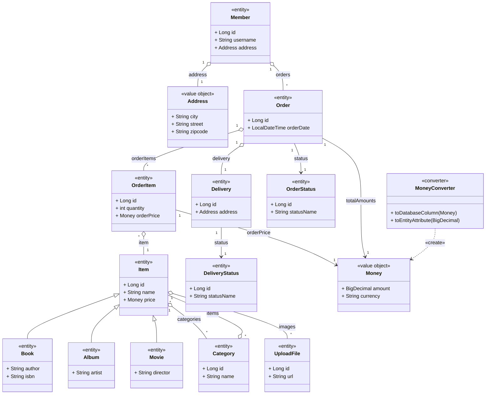

```mermaid
classDiagram
    %% ==== Superclasses & Subclasses ====
    class Item {
      <<entity>>
      + Long id
      + String name
      + Money price
    }
    class Book {
      <<entity>>
      + String author
      + String isbn
    }
    class Album {
      <<entity>>
      + String artist
    }
    class Movie {
      <<entity>>
      + String director
    }

    Item <|-- Book
    Item <|-- Album
    Item <|-- Movie

    %% ==== Item ↔ Category (N:M) ====
    class Category {
      <<entity>>
      + Long id
      + String name
    }
    Item "1" o-- "*" Category : categories
    Category "*" o-- "*" Item : items

    %% ==== Item ↔ UploadFile (1:N) ====
    class UploadFile {
      <<entity>>
      + Long id
      + String url
    }
    Item "1" o-- "*" UploadFile : images

    %% ==== Member & Address ====
    class Member {
      <<entity>>
      + Long id
      + String username
      + Address address
    }
    class Address {
      <<value object>>
      + String city
      + String street
      + String zipcode
    }
    Member "1" o-- "1" Address : address

    %% ==== Order Aggregate ====
    class Order {
      <<entity>>
      + Long id
      + LocalDateTime orderDate
    }
    class OrderItem {
      <<entity>>
      + Long id
      + int quantity
      + Money orderPrice
    }
    class Delivery {
      <<entity>>
      + Long id
      + Address address
    }

    Member "1" o-- "*" Order : orders
    Order "1" o-- "*" OrderItem : orderItems
    OrderItem "*" o-- "1" Item : item
    Order "1" o-- "1" Delivery : delivery

    %% ==== Status & Money ====
    class OrderStatus {
      <<entity>>
      + Long id
      + String statusName
    }
    class DeliveryStatus {
      <<entity>>
      + Long id
      + String statusName
    }
    class Money {
      <<value object>>
      + BigDecimal amount
      + String currency
    }
    class MoneyConverter {
      <<converter>>
      + toDatabaseColumn(Money)
      + toEntityAttribute(BigDecimal)
    }

    Order "1" --> "1" OrderStatus : status
    Delivery "1" --> "1" DeliveryStatus : status

    %% ==== Price Calculation ====
    OrderItem "1" --> "1" Money : orderPrice
    Order "1" --> "1" Money : totalAmounts
    MoneyConverter ..> Money : «create»

```